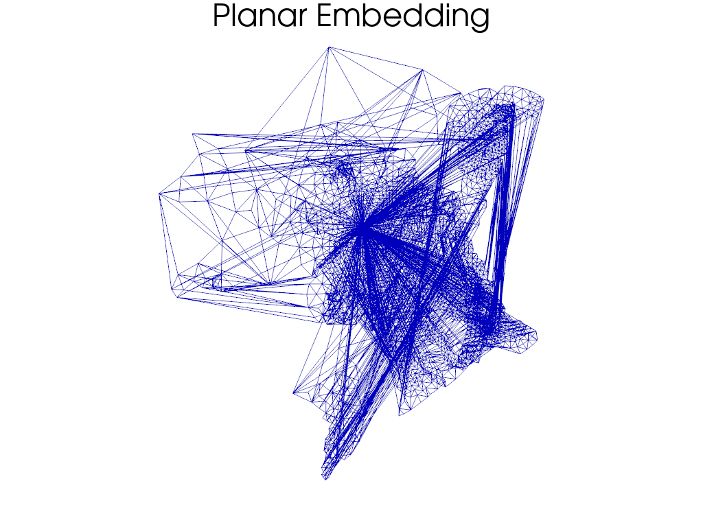
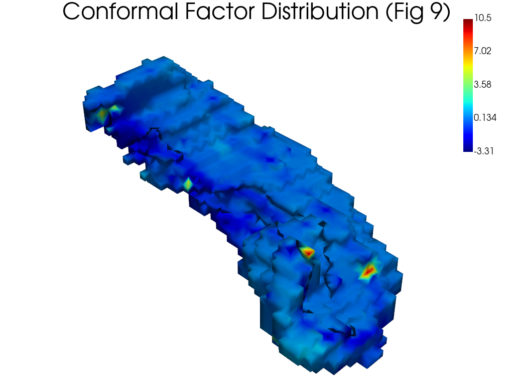
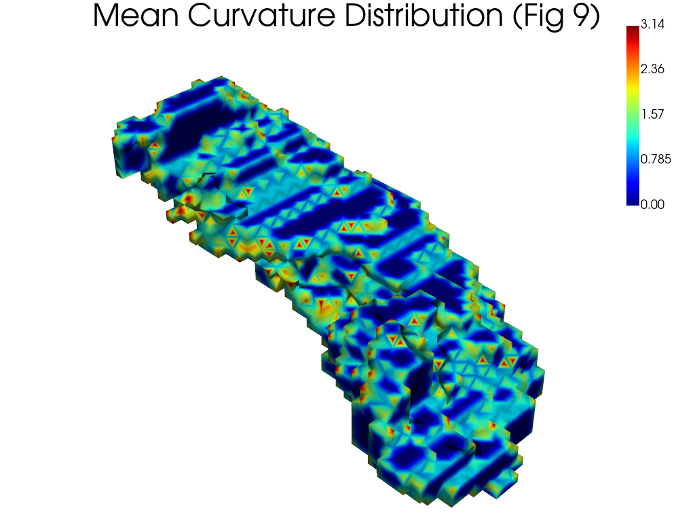
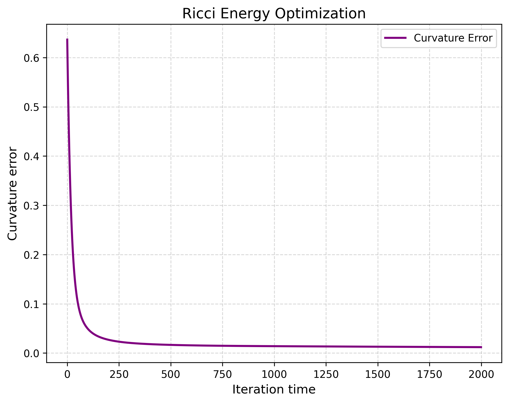
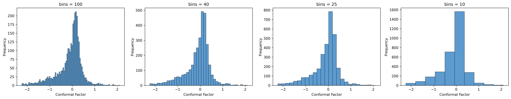

# 3D Geometric Analysis & Shape Diagnosis


> **Current Status:** 🚧 *Active Development* (Phase 1: Baseline Reproduction Completed)

## 📖 Introduction
This project explores **Computational Geometry** techniques for 3D medical shape analysis. The primary goal is to bridge the gap between **classical geometric methods** (e.g., Conformal Geometry, Ricci Flow) and **modern geometric deep learning**.

Currently, I have successfully reproduced the baseline algorithm from *Ahmadi et al. (2024)*, which utilizes **Discrete Ricci Flow** to parameterize the hippocampal surface and extracts **Shannon Entropy** features for Alzheimer's Disease diagnosis.

Future iterations will focus on benchmarking this against spectral methods (HodgeNet) and diffusion-based learning (DiffusionNet).

## 🚀 Key Features (Implemented)
The current codebase (`/src`) implements a complete pipeline for explicit geometric feature engineering:

* **Discrete Surface Ricci Flow:** Implemented the optimization process using Newton's method to compute the conformal factor.
* **Conformal Parameterization:** Mapping 3D genus-0 surfaces to the 2D planar domain.
* **Curvature Analysis:** Calculation of **Gaussian Curvature**, **Mean Curvature**, and **Conformal Factors** (area distortion).
* **Entropy-based Fingerprinting:** converting dense geometric maps into compact feature vectors using Shannon Entropy.

## 📊 Reproduction Results
I have verified the implementation by reproducing key visualizations from the original paper.

| Conformal Factor Map | Mean Curvature Map |
| :---: | :---: |
|  |  |
| *Visualizing area distortion after flattening* | *Extrinsic curvature features on the surface* |

| Optimization Energy | Feature Distribution (Entropy) |
| :---: | :---: |
|  |  |
| *Ricci flow convergence (Newton's Method)* | *Histogram of Conformal Factors* |

## 🧠 Literature & Insights
Unlike a simple code dump, this project is driven by a deep dive into geometric processing literature. I maintain detailed notes on the evolution from manual feature engineering to end-to-end learning.


👉 **[Read my Technical Notes: From Ricci Flow to DiffusionNet](docs/geometry_learning_notes.md)**

*Topics covered in notes:*
* *Explicit vs. Implicit Geometric Features*
* *Why Ricci Flow is sensitive to topology*
* *The shift towards Discretization-Agnostic Learning (DiffusionNet)*

## 📂 Project Structure
```text
.
├── assets/                  # Visualization outputs and figures
├── data/                    # 3D Mesh data (.ply) and processed results
├── docs/                    # Literature review and technical notes
├── src/                     # Core Algorithm Implementation
│   ├── ricci_flow.py        # Discrete Ricci Flow & Newton Optimization
│   ├── math_ops.py          # Differential Geometry Operators
│   ├── entropy.py           # Shannon Entropy Calculation
│   └── feature.py           # Feature Extraction Pipeline
└── main.py                  # Entry point for the pipeline
```

## 🗺️ Project Roadmap

This project is structured in three phases:

### Phase 1: Classic Baseline Method (Completed ✅)
- [x] Implementation of Discrete Ricci Flow.
- [x] Reproduction of the Shannon Entropy-based feature extraction method.

### Phase 2: Modern Benchmark Models (In Progress 🔄)
- [ ] Implementation/Fine-tuning of DiffusionNet on the same dataset.
- [ ] Comparison of model robustness against varying mesh resolutions.

### Phase 3: Comparative Analysis
- [ ] Visualization of the differences in the "feature space" between explicit geometric features and learned features.

## 🛠️ Getting Started

### Prerequisites
- Python 3.8+
- Core libraries: NumPy, Scipy, Nibabel, Trimesh
- Optional(for visualization): Matplotlib, Seaborn, PyVista

### Usage
Run the main pipeline to process the example hippocampus mesh data:
```bash
python main.py
```
After execution, processed results will be saved in the `data/processed/` directory, and visualizations will be saved in the `assets/` directory.

---
*Created by Xiaoyu Liu*