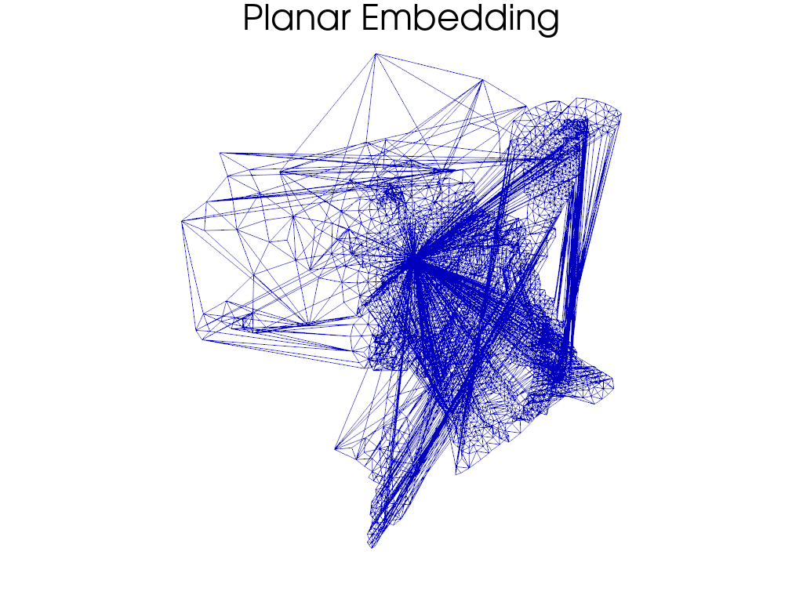
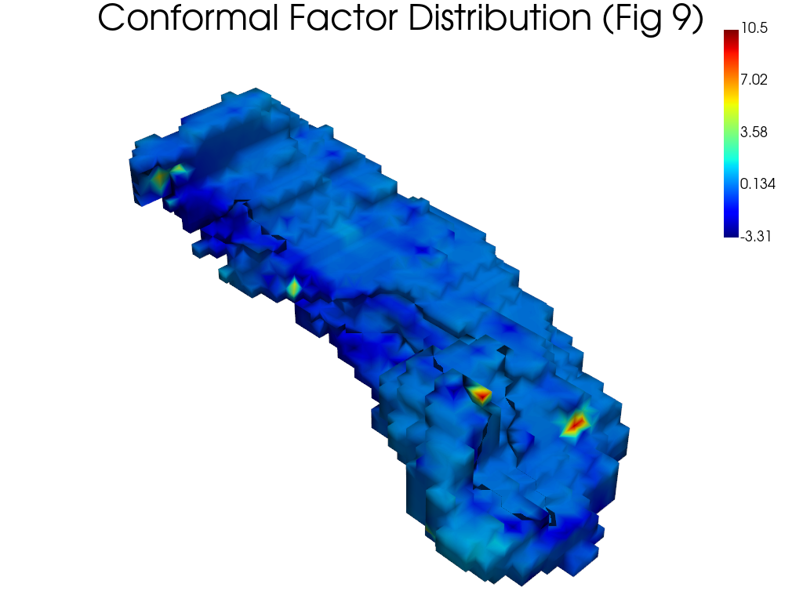
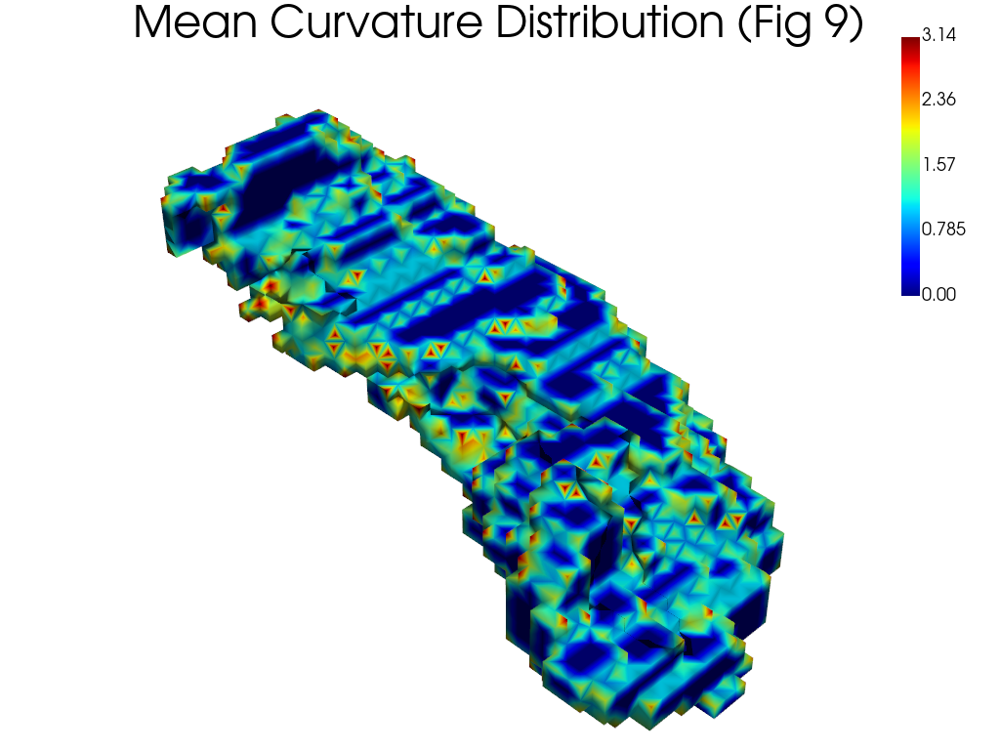
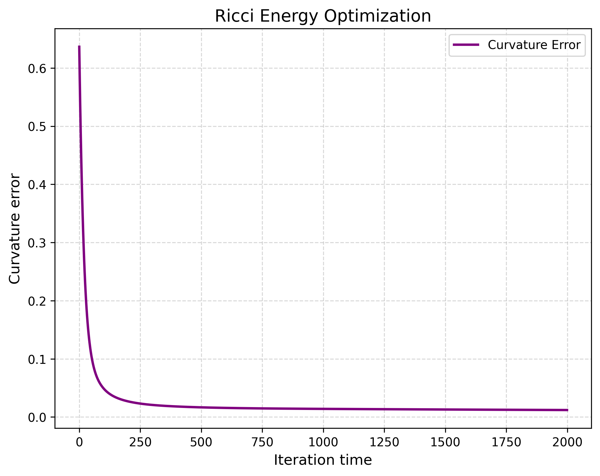
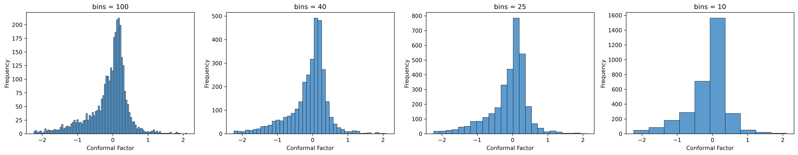

# 3D Geometry Laboratory: From Discrete Ricci Flow to DiffusionNet & HodgeNet


> **Current Status:** 🚀 Phase 2 in Progress (Transitioning from Discrete Ricci Flow to Diffusion-based Learning)

## 📖 Introduction
Traditional 3D shape diagnosis often relies on manually engineered features (e.g., Ricci Flow-based entropy). However, these methods are often sensitive to mesh resolution and noise. This project aims to benchmark Classic Conformal Geometry against State-of-the-art Geometric Deep Learning (GDL) architectures like DiffusionNet and HodgeNet.

We investigate a critical question: Can learned spectral features capture the subtle anatomical deformations that classical Ricci Flow targets?
## 🚀 Baseline Set-up
###  Key Features
The current codebase (`/src`) implements a complete pipeline for explicit geometric feature engineering:

* **Discrete Surface Ricci Flow:** Implemented the optimization process using Newton's method to compute the conformal factor.
* **Conformal Parameterization:** Mapping 3D genus-0 surfaces to the 2D planar domain.
* **Curvature Analysis:** Calculation of **Gaussian Curvature**, **Mean Curvature**, and **Conformal Factors** (area distortion).
* **Entropy-based Fingerprinting:** converting dense geometric maps into compact feature vectors using Shannon Entropy.

### 💾 Data Source
To validate the reproducibility of the algorithm, this project currently utilizes standard benchmark data provided by **FreeSurfer**:

* **Source:** FreeSurfer standard subject (`bert`).
* **Region of Interest (ROI):** Left Hemisphere Hippocampus.
* **Preprocessing:** The original surface data was extracted from the `bert` subject and converted to `.ply` format for geometric processing using `trimesh`.

> *Note: While the original paper analyzes a private ADNI dataset, this project successfully validates the geometric pipeline on standard anatomical data.*

### 📊 Reproduction Results
I have verified the implementation by reproducing key visualizations from the original paper.

| Conformal Factor Map | Mean Curvature Map |
| :---: | :---: |
|  |  |
| *Visualizing area distortion after flattening* | *Extrinsic curvature features on the surface* |

| Optimization Energy | Feature Distribution (Entropy) |
| :---: | :---: |
|  |  |
| *Ricci flow convergence (Newton's Method)* | *Histogram of Conformal Factors* |

### 🧠 Literature & Insights
Unlike a simple code dump, this project is driven by a deep dive into geometric processing literature. I maintain detailed notes on the evolution from manual feature engineering to end-to-end learning.

👉 **[Read my Technical Notes: From theory to code](docs/classical_geometry_pipeline.md)**

👉 **[Read my Technical Notes: From Ricci Flow to DiffusionNet](docs/geometry_learning_notes.md)**


## 🧠 DiffusionNet

### Key Observation
A key characteristic of DiffusionNet is that it learns surface features by solving the heat equation. I found this particularly interesting and therefore examined it in more detail.
The core is the Diffusion Layer $h_t$, which is governed by the Laplace-Beltrami Operator $\Delta_M$:

$$
\frac{\partial \mathbf{u}}{\partial t} = \Delta_M \mathbf{u}
$$

In our discrete mesh implementation, we solve this via an Implicit Euler step, leading to the symmetric system:

$$
(M + tL) \mathbf{u}(t) = M \mathbf{u}(0)
$$

Where:
- $L$ (Stiffness Matrix): Encodes local geometry via Cotangent Weights.
- $M$ (Mass Matrix): Encodes local Voronoi areas.
- $t$ (Learnable Time): Allows the network to automatically choose the "receptive field" size for each feature.

👉 **[Read my Technical Notes: Laplacian in DiffusionNet](docs/laplacian_in_diffusionNet.pdf)**

### 📊 SOTA Replication & Benchmarking

I have conducted extensive replication experiments on DiffusionNet (Sharp et al. 2022) across multiple 3D tasks to evaluate its robustness compared to classical methods.

| Task          | Dataset      | Input  | My Result (Acc/Err) | Official Baseline | Status        |
| ------------- | ------------ | ------ | ------------------- | ----------------- | ------------- |
| Classification | SHREC11      | HKS    | 100%                | 99.4%             | ✅ Replicated |
| Human Seg.    | Maron17      | XYZ    | 90.95%              | 90.65%            | 🚀 Surpassed  |
| Func. Map     | FAUST        | XYZ    | 2.59% (Err)         | 4.73% (Err)       | 🔥 Optimized  |
| Bio-Seg.      | RNA Mesh     | HKS    | 84.44%              | ~84%              | ✅ Replicated |

👉 **[Detailed Replication Report & Logs](benchmarks/diffusion_net/replication.md)**

## 📂 Project Structure
```text
.
├── assets/                  # Visualization outputs and figures
├── data/                    # 3D Mesh data (.ply) and processed results
├── docs/                    # Literature review and technical notes
├── src/                     # Core Algorithm Implementation
│   ├── ricci_flow.py        # Discrete Ricci Flow & Newton Optimization
│   ├── math_ops.py          # Differential Geometry Operators
│   ├── entropy.py           # Shannon Entropy Calculation
│   └── feature.py           # Feature Extraction Pipeline
├── benchmarks/              # New: replication and comparative experiments
│   ├── diffusion_net/       # DiffusionNet topic
│       ├── logs/            # Original logs from screenshots
│       └── replication.md   # replication report
└── main.py                  # Entry point for the baseline pipeline
```

## 🗺️ Project Roadmap

This project is structured in three phases:

### Phase 1: Classic Baseline Method (Completed ✅)
- [x] Implementation of Discrete Ricci Flow.
- [x] Reproduction of the Shannon Entropy-based feature extraction method.

### Phase 2: Modern Benchmark Models (In Progress 🔄)
- [ ] Implementation/Fine-tuning of DiffusionNet on the same dataset.
- [ ] Implementation/Fine-tuning of HodgeNet on the same dataset.
- [ ] Comparison of model robustness against varying mesh resolutions.

### Phase 3: Comparative Analysis
- [ ] Visualization of the differences in the "feature space" between explicit geometric features and learned features.

## 🛠️ Getting Started

### Prerequisites
- Python 3.8+
- Core libraries: NumPy, Scipy, Nibabel, Trimesh
- Optional(for visualization): Matplotlib, Seaborn, PyVista

### Usage
Run the main pipeline to process the example hippocampus mesh data:
```bash
python main.py
```
After execution, processed results will be saved in the `data/processed/` directory, and visualizations will be saved in the `assets/` directory.

## 📚 References
This project implements algorithms and concepts from the following literature:

1. [Primary Reproduction] Ahmadi, F., et al. (2024). "Alzheimer's disease diagnosis by applying Shannon entropy to Ricci flow-based surface indexing and extreme gradient boosting." Computer Aided Geometric Design.

2. [Geometric Deep Learning] Sharp, N., et al. (2022). "DiffusionNet: Discretization Agnostic Learning on Surfaces." ACM Transactions on Graphics (TOG).

3. [Spectral Geometry] Smirnov, D., & Solomon, J. (2021). "HodgeNet: Learning Spectral Geometry on Triangle Meshes." SIGGRAPH.

4. [Data Source] FreeSurfer: https://surfer.nmr.mgh.harvard.edu/

---

*Created by Xiaoyu Liu*


