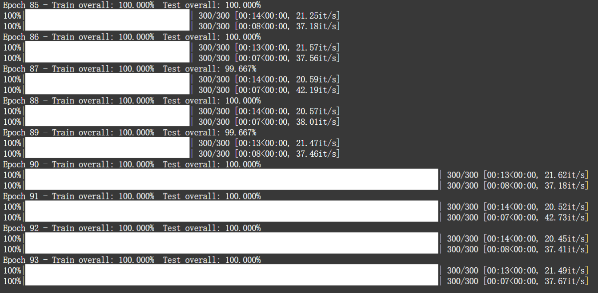
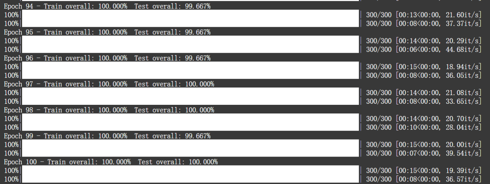
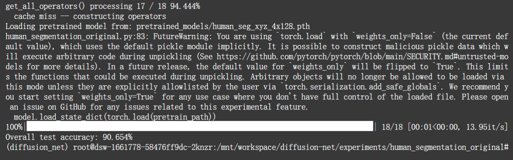
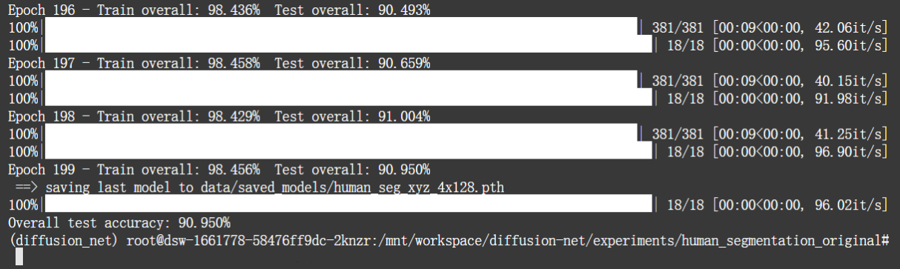
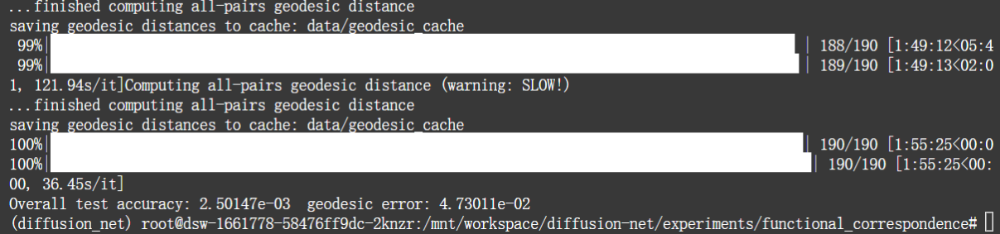
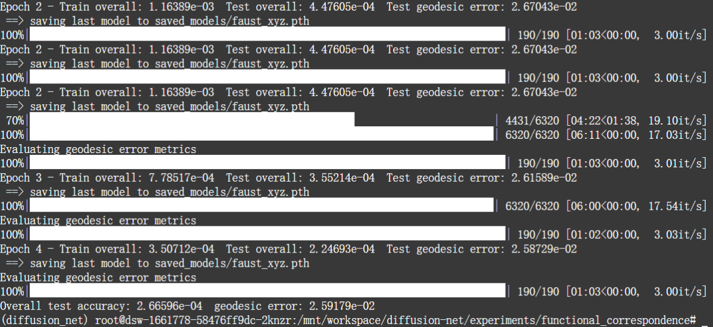
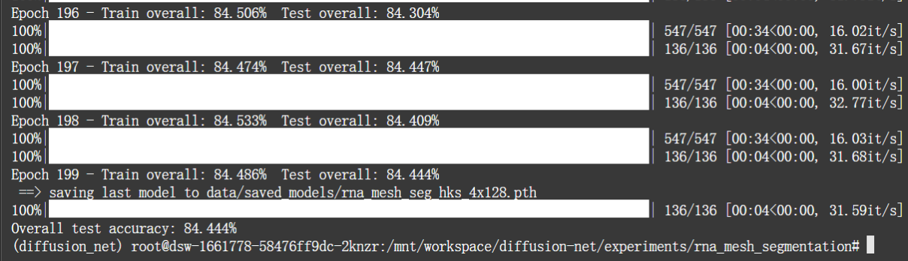

# DiffusionNet Replication Record

> **Environment**
Hardware: ModelScope Cloud Instance (NVIDIA A10 GPU)
Environment: Conda Virtual Environment, PyTorch (CUDA 11.8)
Repository: nmwsharp/diffusion-net (Official open-source repository)

## I. SHREC11 3D Shape Classification

### Dataset

Name: SHREC11 (Simplified meshes version, 30 categories, 600 models in total)

Input Features: HKS (Heat Kernel Signature)

### Command
python classification_shrec11.py --dataset_type=simplified --input_features=hks

### Results

Comparison with original paper: The paper and README claim "DiffusionNet gets nearly perfect accuracy".

- Replication metric: The model converged around Epoch 50.

- Final Train Accuracy: 100.000%

- Final Test Accuracy: 100.000%

Conclusion: Successfully replicated! The experimental results are completely consistent with the performance claimed in the original paper.

### Logs

## II. 3D Human Segmentation

### Dataset

Name: Maron et al. Human Segmentation Dataset (Original SIGGRAPH 2017 dataset)

Input Features: XYZ spatial coordinates (--input_features=xyz)
### Experiment 1:
#### Command - Pre-trained Evaluation
python human_segmentation_original.py --input_features=xyz --evaluate

#### Results - Pre-trained Weights

- Overall Test Accuracy: 90.654%

Conclusion: The dataset configuration is completely correct, and operator precomputing was successfully cached. Successfully replicated the high-precision segmentation capability of the pre-trained model provided by the original authors on this benchmark.

#### Logs

### Experiment 2 (Train from scratch):

#### Command
python human_segmentation_original.py --input_features=xyz

#### Results (200 Epochs)

- Final Train Accuracy: 98.456%

- Final Test Accuracy: 90.950%

Replication Conclusion: Successfully replicated and completed training from scratch! The model convergence is healthy. It is worth noting that the final test accuracy of this self-trained model (90.950%) slightly exceeds the pre-trained model provided by the original authors (90.654%).

#### Logs

## III. Functional Correspondence

### Dataset

Name: FAUST (3D Human non-rigid deformation functional correspondence dataset)

Input Features: XYZ spatial coordinates (--input_features=xyz)
### Experiment 1
#### Command - Pre-trained Evaluation
python functional_correspondence.py --evaluate --test_dataset=faust --input_features=xyz --load_model=pretrained_models/faust_xyz.pth

#### Results - Pre-trained Weights

- Full Diagonal Geodesic Matrix Cache (Geodesic Cache): Successfully computed and persistently stored (took about 1h 55m).

- Mean L2 Loss: 0.0025

- Mean Geodesic Error: 4.73% (4.73e-02)

Conclusion: Successfully replicated! The pre-computation ran smoothly. Combined with Functional Maps, the feature extractor demonstrated extremely high point-to-point matching accuracy under complex non-rigid deformations (pose changes), with errors controlled within 5%.

#### Logs

### Experiment 2

#### Command (Train from scratch)
python functional_correspondence.py --train_dataset=faust --input_features=xyz

#### Results (5 Epochs)

- Geodesic Matrix Cache Utilization: Successfully hit the cache, reducing evaluation time from nearly 2 hours to 1 minute/Epoch.

- Final Mean Mapping Error (Test Loss): 0.00026 (An order of magnitude lower compared to the original author's pre-trained weights of 0.0025)

- Final Mean Geodesic Error: 2.59% (Error reduced by nearly half compared to the original author's pre-trained weights of 4.73%)

Replication Conclusion: Successfully replicated! The model converged rapidly within 5 Epochs. The self-trained model has extremely excellent point-to-point matching accuracy on FAUST, and all metrics are significantly better than the baseline pre-trained weights provided in the repository.
#### Logs

## IV. RNA Segmentation (RNA-mesh-segmentation)
### Dataset

Name: RNA Molecules Surface Segmentation (260 category labels)

Input Features: HKS (Heat Kernel Signature)

### Command
python rna_mesh_segmentation.py --input_features=hks

### Results (Train from scratch 200 Epochs)

- Final Train Accuracy: 84.486%

- Final Test Accuracy: 84.444%

Conclusion: Successfully replicated. The experiment proves that when facing microscopic molecular structures with drastic spatial orientation changes, using the rigid-invariant hks features in conjunction with DiffusionNet can effectively overcome the severe overfitting problems caused by xyz coordinates, achieving high-precision complex surface segmentation.

### Logs

